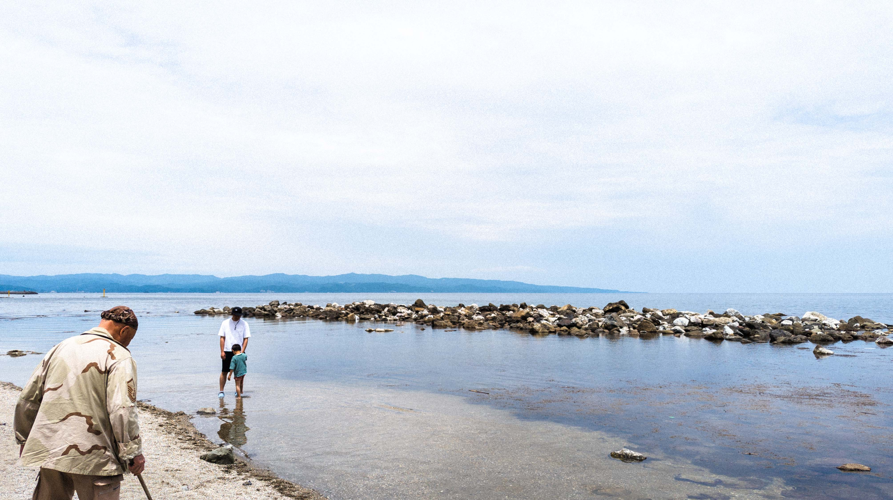
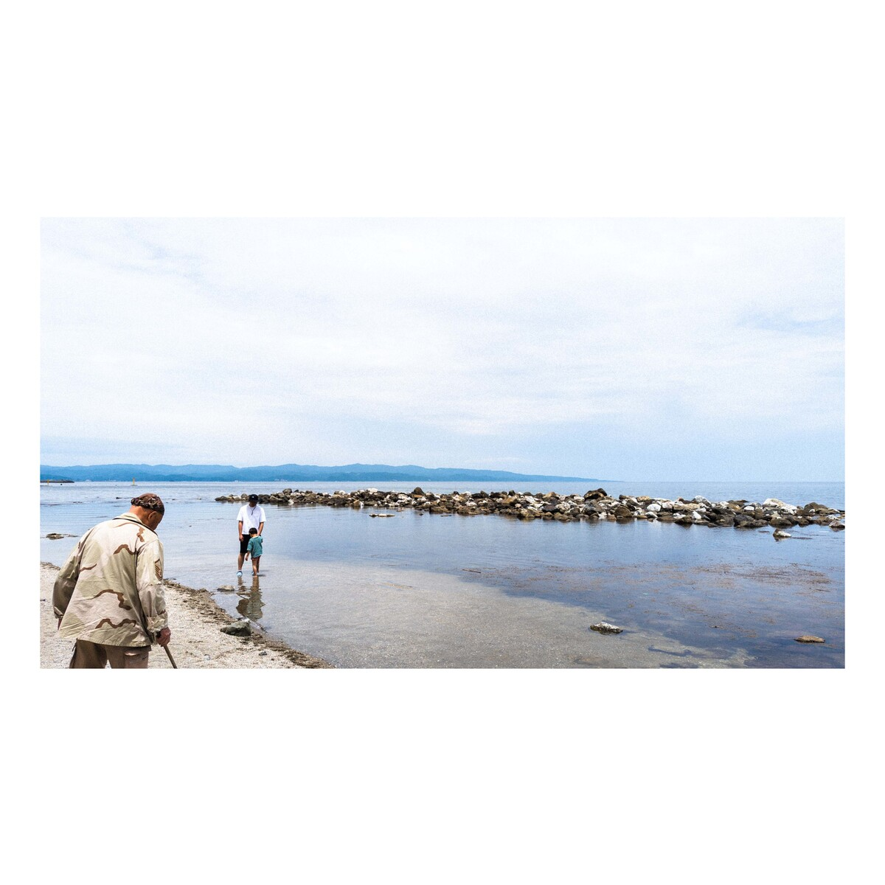

# Imagemagick is magic indeed

Just documenting down how to use `imagemagick` to automate the monotonous process of adding borders and resizing images in order to fit a photo nicely onto instagram profile page.

To use:
```
./convert.sh $image_dir
```

This converts an image from this:


to this:

