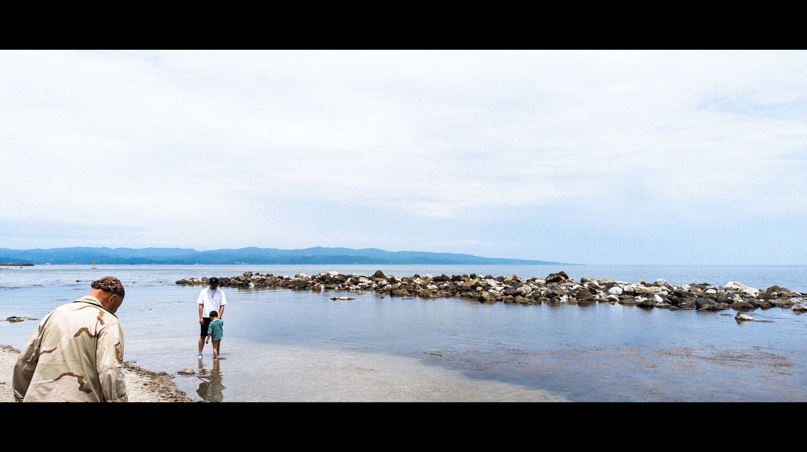

# Imagemagick is magic indeed

Just documenting down how to use `imagemagick` to automate the monotonous process of adding borders and resizing images in order to fit a photo nicely onto instagram profile page.

Also added command to go for a cinematic look.

To use:
```
./convert.sh $image_dir $option
```
`option = 1` will generate a film look white borders
`option = 2` will generate a cinematic look

Before:


After option 1:


After option 2:


